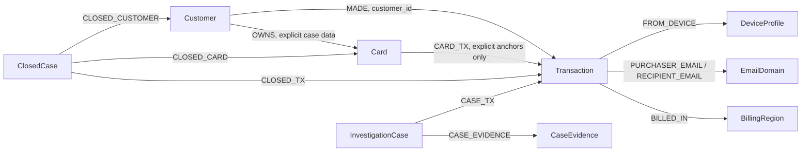
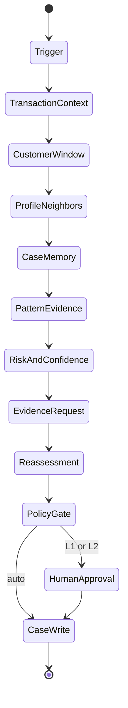

# Architecture

## Investigation boundaries

GraphSentinel has three distinct execution paths:

1. **HHGOA offline benchmark:** `DatasetQueries` reads a private DuckDB index built from the five supplied files. It is reproducible, fast, and used to inspect rules before live graph deployment. Its evidence is marked `external`, and it never claims graph writeback.
2. **HHGOA TigerGraph benchmark:** `TigerGraphDatasetQueries` invokes only installed `hh_*` GSQL queries through `HHGOATigerGraph`. The runner writes an `InvestigationCase` and `CaseEvidence` vertices after each answer, checks TigerGraph's accepted vertex count, and then emits the 20 JSON files with graph provenance.
3. **Interactive synthetic analyst demo:** `Investigator`, `FixtureGraph`, FastAPI, and SQLite demonstrate evidence arrival, reassessment, approval, and case-memory feedback. It is clearly labeled synthetic. The same API can use the canonical TigerGraph adapter after a separate canonical graph import.

The HHGOA path and the synthetic path have different data contracts because the actual dataset has no merchant, account, or per-transaction card ID. They are kept separate rather than coercing HHGOA rows into invented relationships.

## HHGOA graph model

Device profiles are stable hashes of the documented `DeviceInfo`, `id_30` OS, `id_31` browser, and `id_33` screen values. Hashes avoid using raw strings as graph IDs; the original fields remain attributes. A profile match is evidence of shared attributes, not proof that two transactions used the same physical device. The investigator requires at least two populated fields before expansion and independent corroboration before calling a cross-customer cluster coordinated.

`Customer -> MADE -> Transaction` comes from the supplied `customer_id`. `Card -> CARD_TX -> Transaction` is created only when `case_pack.csv` names a flagged transaction or `closed_cases_history.csv` names transaction IDs. No account-transfer, merchant, or `Is Fraud` edge exists in the source, so none is fabricated.

## Installed GSQL and graph algorithms

The graph path uses five bounded queries in [graph/hhgoa_queries.gsql](graph/hhgoa_queries.gsql):

| Query | Graph operation | Why it matters |
| --- | --- | --- |
| `hh_transaction_context` | Transaction → customer → prior transactions and transaction → device profile → peer transactions | Separates isolated model alerts from neighborhood evidence |
| `hh_customer_window` | Customer → transactions within time bounds | Finds velocity, amount repetition, and region baseline |
| `hh_profile_neighbors` | Device profile → transactions → customer groups | Finds shared-origin motifs and possible fraud rings |
| `hh_prior_cases` | Customer → closed cases and written investigations | Retrieves historical outcomes before the current trigger |
| `hh_case_transactions` | Closed case → involved transactions | Makes historical evidence inspectable |

The selected graph algorithm is bounded two-hop neighborhood expansion with motif filtering. It directly supports the challenge's shared profile, cross-customer, and historical-case questions. The system does not claim to run PageRank or connected components; those would add cost without a verified gain on this benchmark. Every expansion has a time bound, an output limit, and a reason recorded in the trace.

## Structured GraphRAG

The retrieval layer does not send raw CSV or arbitrary graph dumps to an LLM. It turns query results into an evidence package with claims, source, query reference, and real entity IDs. Historical outcomes are attached as context and explicitly described as insufficient to label the present transaction. The optional OpenAI summarizer receives only the case package and must cite evidence IDs; invalid citations fail back to the deterministic summary. It cannot change probabilities, action routes, or case persistence.

The HHGOA benchmark currently uses deterministic synthesis (`tokens=0`) so that no API key is needed and benchmark answers can be reproduced. This is a deliberate operational fallback, not an assertion that an LLM call took place.

## State and uncertainty

The HHGOA investigation is a bounded state machine in [engine.py](graphsentinel/hhgoa/engine.py):

Risk probability estimates suspiciousness; evidence confidence estimates completeness. Both are uncalibrated heuristics. A high-risk, medium-confidence case may warrant verification or escalation instead of a block. In the benchmark, the only simulated external evidence is an explicitly labeled 24-hour customer nonresponse. The final action then changes under R4; this is never presented as an observed reply. The interactive demo accepts an actual analyst-entered customer confirmation or denial and reassesses immediately.

Stopping is deliberate: an explicit strong motif with supporting evidence, a customer response, a human approval gate, or low-value remaining expansion ends the automated pass. `stop_reason` states which condition applied. Per-case retrieval calls and latency are recorded. The default cap is 200 customer transactions and 120 profile peers for the immediate investigation; the 30-day baseline query can retrieve at most 10,000 rows from TigerGraph.

## Policy and approvals

Policy identifiers and routes come from the supplied README. [policy.py](graphsentinel/hhgoa/policy.py) is deterministic: automatic actions have route `auto`; `DECLINE_TRANSACTION` and `BLOCK_CARD` up to $2,500 route to `L1`; larger blocks, `BLOCK_ALL_CARDS`, and `FILE_REPORT` route to `L2`. R10 prevents a `BLOCK_ALL_CARDS` proposal without evidence of two compromised cards or compromised credentials. A proposed block or filing is never described as executed. The interactive demo records named analyst approval or rejection and simulates the external bank action.

## Case memory and persistence

Closed cases are loaded as graph vertices with explicit customer, card, and transaction edges. A new investigation retrieves prior cases only if they were closed before its trigger. The writeback path adds an investigation vertex, evidence vertices, and case links. Later `hh_prior_cases` calls can see these investigation vertices. The synthetic analyst workflow also stores the case progression in SQLite and writes resolved outcomes to the graph port so a subsequent investigation can retrieve them.

The current offline outputs do not have TigerGraph writeback, and the HHGOA benchmark contract restricts `similar_prior_cases` to the supplied `CC-*` history IDs. The live graph can hold and query `HHG-*` investigation memory without misreporting it as a supplied closed case.

## Errors and security

Inputs use Pydantic models and fixed query names; MCP tools cap limits. TigerGraph credentials are read from environment variables. The private raw dataset and DuckDB index are Git-ignored. Graph request errors surface as a service error or abort the live benchmark before local answer files are replaced. The case contract forbids inconsistent SAR fields, fake graph-write flags, and malformed actions. Retrieved document text is treated as evidence, not instructions. The UI escapes rendered case text.

The principal unresolved integration risk is live GSQL compilation and REST response shape. Those require a TigerGraph instance; the importer payloads have only been exercised in complete dry-run mode.
