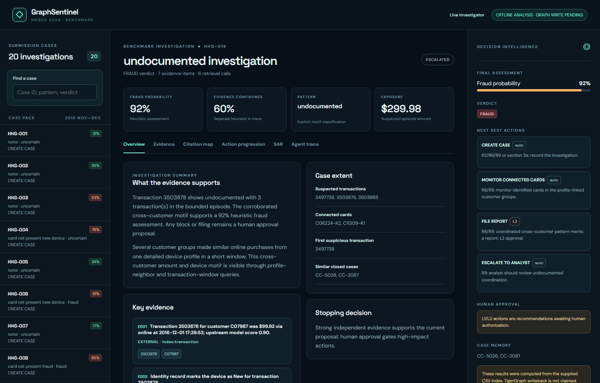
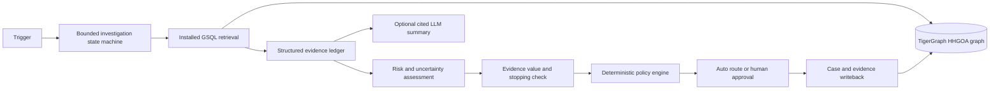

# GraphSentinel

An evidence-driven fraud investigation system for the Hacker House Goa 2026 TigerGraph trial. It takes a transaction trigger, explores connected identities and historical cases, records uncertainty, and proposes policy-routed next actions. The repository contains a working analyst UI, a synthetic live investigation demo, an HHGOA dataset investigation pipeline, 20 answer files, TigerGraph schema and installed GSQL queries, an importer, a restricted graph client, an MCP facade, tests, and a benchmark audit.

**Current verification:** the 20 HHGOA answers were produced from the supplied CSVs through a local read-only index. Their `written_to_graph` fields are `false`, and their row evidence uses `source: external`. The TigerGraph schema, import path, query adapter, and writeback path are implemented but have not been run against a live instance because no endpoint or token has been supplied. The [benchmark report](BENCHMARK_RESULTS.md) records this explicitly.

**Public benchmark preview:** [1sakshm.github.io/TigerGraph](https://1sakshm.github.io/TigerGraph/) displays the 20 committed investigations and traces on GitHub Pages. It is read-only; the interactive synthetic investigator runs in the Python service.

**Host the interactive demo:** [Deploy to Render](https://render.com/deploy?repo=https://github.com/1sakshm/TigerGraph) uses the repository's `render.yaml` and Dockerfile. It runs only the labeled synthetic demo; the real 20-case benchmark remains available at the Pages link above.



## Why relationships matter

A model score identifies a transaction worth investigating; it does not explain whether a customer, device profile, or cluster of other customers is involved. GraphSentinel asks bounded relationship questions: what else did this customer group do, who shares the detailed device profile, which closed cases involve related entities, and whether a suspicious sequence crosses cards or regions. It keeps the original transaction and every cited ID in an evidence ledger. The LLM, when configured, can summarize cited evidence but cannot invent graph edges, set policy routes, or execute bank actions.

## Dataset and provenance

The user supplied the [HHGOA IEEE dataset folder](https://drive.google.com/drive/folders/1YDJUW1fiE7Jx8R9KqknC4IcsED9zll2A?usp=sharing). Its README was read before the HHGOA schema and case contract were built. It contains 590,742 transactions, 144,432 identity rows, 5,565 closed cases, and 20 benchmark triggers. It contains no transaction fraud label, merchant ID, or explicit card ID on each transaction. `customer_id` joins the transaction rows; card IDs occur in the case pack and closed-case history. The importer creates `CARD_TX` only for those explicit anchors. The original V/C/D/M/id feature families retain their documented opaque meanings; no human meanings are assigned to unnamed codes.

The raw files and derived index remain under ignored `data/private/`. The repository includes only derived case answers and the small, clearly labeled synthetic demo fixture. Do not use public Kaggle fraud labels to infer benchmark outcomes.

## Architecture



The HHGOA benchmark has two retrieval ports. The **offline port** uses a read-only DuckDB index of the supplied CSVs to develop and audit the rules. The **TigerGraph port** invokes only the five installed `hh_*` GSQL queries and can write each complete case back to the graph. The two ports share the same evidence and action contract. The analyst UI has a `/benchmark` page for the real 20-case outputs and a `/` page for the interactive synthetic evidence/approval workflow. The synthetic page cannot be mistaken for benchmark evidence: its mode badge and case provenance say so.

See [ARCHITECTURE.md](ARCHITECTURE.md) and [DESIGN_DECISIONS.md](DESIGN_DECISIONS.md) for the graph schema, GraphRAG packaging, uncertainty, memory, and policy choices.

## Reproduce the 20 answers on Windows PowerShell

Python 3.11 or newer is required. Run from the repository root:

```powershell
py -3.12 -m venv .venv
.venv\Scripts\python -m pip install -e ".[test,analysis,data]"
.venv\Scripts\python -m scripts.download_hhgoa
.venv\Scripts\python -m scripts.build_analysis_index
.venv\Scripts\python -m scripts.run_hhgoa_benchmark
.venv\Scripts\python -m scripts.evaluate_hhgoa
.venv\Scripts\python -m pytest -q
```

The runner writes `cases/HHG-001.json` through `cases/HHG-020.json` and investigation traces under `cases/investigations/`. `BENCHMARK_RESULTS.md` is regenerated by the evaluator. Each file follows the supplied README's exact answer shape: case, evidence requests, initial and final next actions, SAR, stopping reason, retrieval count, token count, and latency. Simulated 24-hour nonresponses are labeled; no reply is presented as observed testimony.

## TigerGraph path

Create a TigerGraph Savanna or Community Edition graph with permission to install GSQL and upsert data. Apply [graph/hhgoa_schema.gsql](graph/hhgoa_schema.gsql), then [graph/hhgoa_queries.gsql](graph/hhgoa_queries.gsql) with your TigerGraph GSQL client. Set connection details in your local environment, never in Git:

```powershell
$env:TIGERGRAPH_URL="https://YOUR-REST-ENDPOINT"
$env:TIGERGRAPH_TOKEN="YOUR-TOKEN"
$env:TIGERGRAPH_GRAPH="HHGOA"
.venv\Scripts\python -m scripts.import_hhgoa_graph --dry-run --limit 3
.venv\Scripts\python -m scripts.import_hhgoa_graph
.venv\Scripts\python -m scripts.run_hhgoa_benchmark --tigergraph
.venv\Scripts\python -m scripts.evaluate_hhgoa
```

The dry run has been exercised across all 590,742 + 144,432 + 5,565 + 20 source rows. The live commands still require a real endpoint. The importer is idempotent and supports `--phase` and `--limit` for bounded smoke tests. The live runner writes the 20 local answer files only after all graph retrievals and case writebacks succeed. It stages a case with `written_to_graph=false`, verifies accepted case/evidence vertices and every case edge, then marks the stored answer graph-backed. Each upsert is atomic, but the three requests are not one transaction; a failed case can leave a retryable staged record. Installed queries are allowlisted; no user-supplied GSQL is executed.

## Run the analyst interface

The always-available synthetic workflow demonstrates live case progression, customer evidence, policy gating, analyst approval, and case memory. It uses transaction `T100` and is labeled synthetic:

```powershell
$env:GRAPHSENTINEL_MODE="demo"
.venv\Scripts\python -m graphsentinel.server
```

Open `http://127.0.0.1:8000/` for the interactive demo and `http://127.0.0.1:8000/benchmark` for the 20 real dataset outputs. Follow [DEMO.md](DEMO.md) for a five-minute walk-through. The optional OpenAI summary requires `OPENAI_API_KEY` and `OPENAI_MODEL`; core investigation and policy work without an LLM key.

## Policy, safety, and case memory

The HHGOA action names and L1/L2 routes follow policy R1–R10 from the supplied README. The deterministic policy layer routes `BLOCK_CARD`, `DECLINE_TRANSACTION`, and `FILE_REPORT` to humans and forbids `BLOCK_ALL_CARDS` without evidence of a wider compromise. Risk and evidence confidence are tracked separately; a model score never becomes an automatic block. The interactive demo persists case progression in SQLite and, in TigerGraph mode, upserts the case, evidence, and entity links. The HHGOA graph schema stores closed cases and investigation cases so installed GSQL can retrieve prior outcomes. Historical outcomes are supporting context, never a label for a new transaction.

## What is verified and what remains

- 20/20 answer files pass contract, cited-ID, approval-route, and report consistency checks. The current audit finds 99 evidence items, 10 changed next-action lists, and three L2 SAR draft recommendations.
- The UI and API are running locally; the benchmark view was captured from a headless browser. The synthetic approval flow has API tests.
- The full import payload builder ran in dry-run mode over all supplied rows. GSQL compilation, live query responses, import acceptance, and graph case writeback need a TigerGraph connection. The current answer files make no contrary claim.
- The probabilities and confidence values are transparent heuristics, not statistically calibrated. Current-case outcome labels are withheld, so local pattern accuracy and calibration cannot be honestly measured.
- The dataset lacks an explicit merchant ID and per-transaction card key. Some suspected episodes and connected-card associations remain provisional; evidence text identifies that limit.

## Repository map

| Path | Purpose |
| --- | --- |
| `graphsentinel/hhgoa/` | Exact challenge contract, dataset and graph ports, investigation, policy, writeback |
| `graph/hhgoa_*.gsql` | HHGOA graph schema and installed bounded traversal queries |
| `scripts/` | Download, index, import, benchmark, evaluation |
| `cases/HHG-*.json` | 20 submitted answer artifacts |
| `frontend/` | Interactive investigator and benchmark command center |
| `tests/` | Contract, policy, graph payload, API, case progression, benchmark checks |
| `docs/` | Design specification and implementation plan |

The prepared [technical blog](BLOG.md) and [social post](SOCIAL_POST.md) are drafts. A recorded demo video and external publication remain separate submission steps.

See [DEPLOYMENT.md](DEPLOYMENT.md) for the read-only GitHub Pages preview and the containerized FastAPI deployment path.
